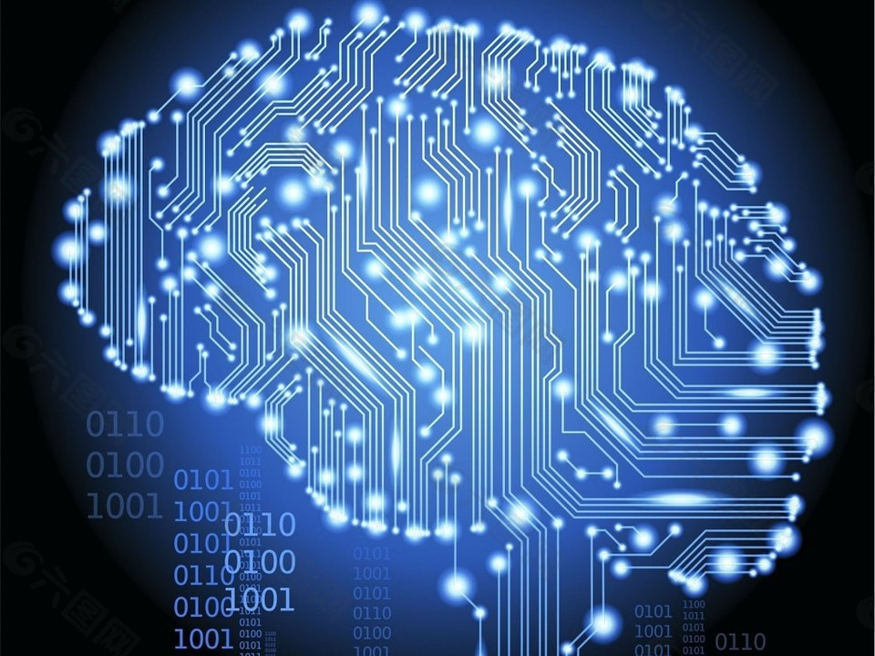

# 未来人类意识能否移植

## 一、意识不能脱离载体而存在

古来风流人物达到人生巅峰之后，都想长生不老，青春永驻。寻求长生的方法无非是寻仙问药，确保肉身不化。所谓羽化，讲的也是人乘鹤西去，而非灵魂飞升。

意识的活动，需要借助器官去感知、存储、信息传递，脱离了人体，意识活动的能量从哪里来？意识如何去感知世界？意识如何存储？所以，肉体死亡的那一刻，意识也随之死亡！如同将计算机断电，计算机会立刻停止运行。

既然意识附于载体，那么意识是否可以移植到新的载体呢？

## 二、意识能够复制

未来科学家若完全弄清楚了人脑的架构和运转方式，拷贝意识到新的载体是完全有可能的，且可以无限复制。若新载体的空间结构更先进，信息传递更高效，记忆存储更持久，到那时人类的智力将永恒进化。

至于能不能进化到更高级的文明，那只能取决于天命了。
