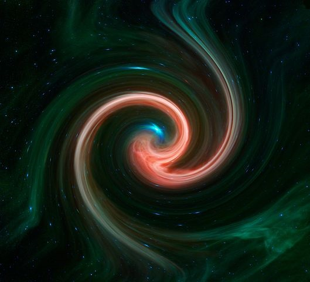
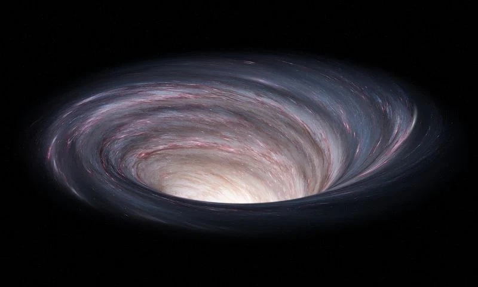
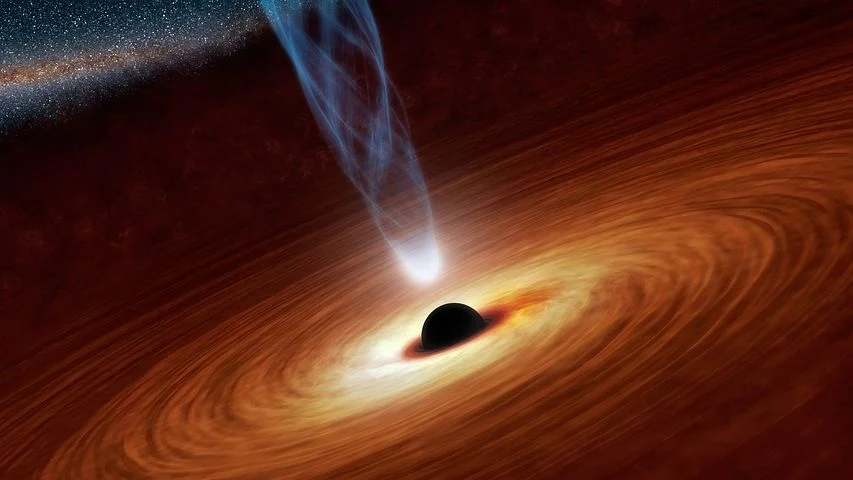

# 有没有永恒的存在

万物从何而来？源于宇宙大爆炸。

宇宙大爆炸从何而来？源于奇点。

那奇点又从何而来？孕育于大道。

## 一、宇宙万物不存在永恒

宇宙中每个天体都有生死周期，天体由微尘凝聚而诞生，死亡后又复归于微尘。

宇宙有膨胀就会有收缩，收缩到奇点则宇宙死亡，宇宙中的一切物质也会随之消亡。

《道德经》解释得好：大道诞生宇宙万物，如同幽深的漩涡，不停地旋转着，不断地吞进万物，同时又涌出万物。万物都有其生死周期，被大道吞进则解体而毁灭，被大道涌出则被赋予新的结构和生命。

万物生于大道，所以不存在永恒。

## 二、大道永存

宇宙终会消亡，那有没有永恒的存在？

有，那就是生出宇宙的道。

通常人们所理解的永存是物质的永恒，因为人的感官是为了感知物质而生的，能触摸到的东西才认为它存在，进而感知到它的生死；而道是虚无的，幽深而虚漠，清澈而透明，往往让人感觉不到它的存在，大道无形，脱离于生死周期，它是永恒的。
