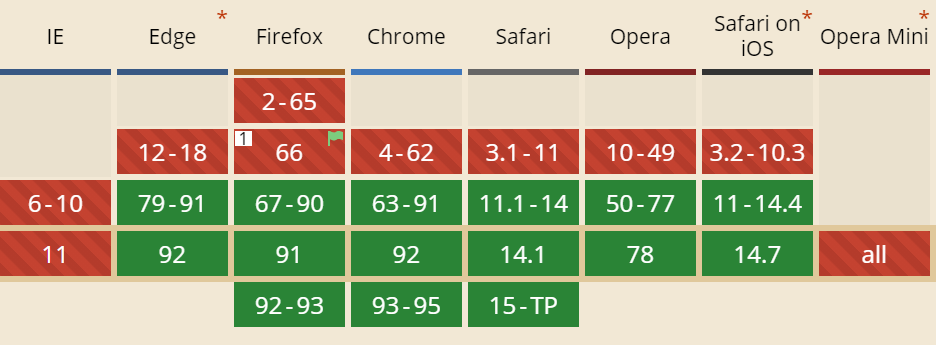

## 为什么需要构建工具

### 无构建工具之痛

#### 笔者曾接到过一个大学图书馆官网的项目，因项目由在校生维护，对接方要求原生开发。随后各种问题接踵而来，什么不兼容`IE`啊，`CSS`样式、`JS`变量被覆盖啊，漫天的`Jquery`操作`dom`啊，线上代码被赤裸裸地暴露啊，不胜枚举。此时才深刻领会到`React`、`Vue`框架、`Css`预处理器、`webpack`构建工具之便利，前端开发中的痛点它们统统帮着解决掉了，可让前端小伙伴高效开发，而无后顾之忧。

#### 示例（`demo1`）
  - 直接使用`ES6 import`语法

        // main.js
        import $ from "jquery";

        $("#title").click(() => {
          $("body").css("backgroundColor", "yellow")
        })

    #### 因浏览器无法识别`ES6 import`语法，故报错如下：
    `
    Uncaught SyntaxError: Cannot use import statement outside a module
    `

    #### 需要将`ES6`语法编写的代码转换成主流浏览器皆可识别的`ES5`代码。

    #### `ES6 module`主流浏览器支持情况如下图：

    

   - 直接引用`index.less`文件
  
          // index.html
          <link rel="stylesheet" href="./index.less">
          
          // index.less
          html,
          body {
            background-color: aqua;
          }

  ##### 背景色没有生效，因浏览器不能识别`less`文件，需将`Less`编译成`Css`

   -  直接引用`greeter.ts`文件，报错如下：
  
      `
      greeter.ts:1 Uncaught SyntaxError: Unexpected token ':'
      `

          // index.html
          
          
          // greeter.ts
          function greeter(person: string) {
            return "Hello, " + person;
          }

          let user = [0, 1, 2];

          document.body.innerHTML = greeter(user); 

  ##### 需要借助编译工具将`Typescript`代码编译成浏览器可识别的Javascript代码

##### 随着Web应用变得越发复杂与庞大，模块化(ES6 模块化、样式模块化)、新框架（`React、Vue`）、新语言（`ES6、TypeScript`）日新月异，层出不穷，他们的出现极大提高了开发效率，解放了生产力。

##### 但是这些技术都有一个共同点：`React、Vue、Es6、Less`等编写的源代码无法在浏览器上直接运行，必须转换成可执行`JavaScrip、CSS、HTML`代码，于是构建工具应运而生。

### 构建工具能做哪些事

#### 包括以下几种转换：

 1. 转换代码 ：
    - `ES6`转换成`ES5`
    - `Less`编译成`Css、Css`前缀自动补齐（为了兼容不同版本的浏览器）
    - `TypeScript`编译成`JavaScript`
    - 转换`JSX`
    - 转换`Vue`
 2. 优化文件
    - 压缩混淆`JavaScript、CSS、HTML`代码（压缩是为了使文件更小，加载速度更快，混淆是为了安全，使得别人难以理解代码逻辑）
    - 压缩合并图片等（合并可以减少`http`请求次数）
 3. 分割代码
    - 提取公共代码（有些库如`React、React-router、Redux`等版本很久才变，可以抽离出来，一当面可减小别的包的体积，另一方面可以利用缓存避免重复加载）
    - 提取首屏不需要执行的代码，让其异步按需加载（比如路由懒加载，`ES6`懒加载）。

### 为什么选择 `Webpack`
市面上前端构建工具很多，笔者在开发中使用的最多的是`webpack`，对其也最为熟悉，本系列随笔主要记录个人对`webpack5`的所学、所思，暂不比较各构建工具的优缺点，以后有时间可再行记录。