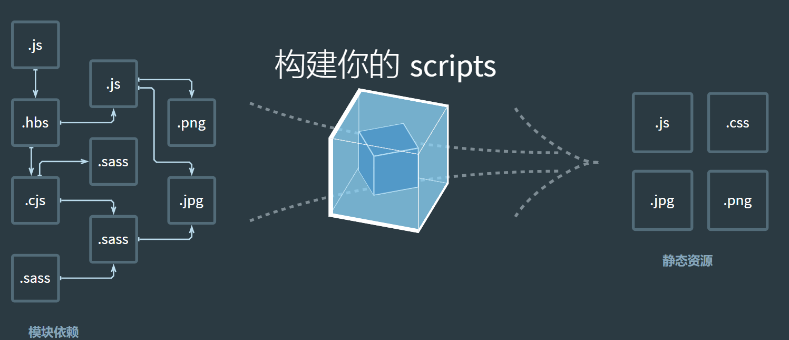

### `webpack`之我见
#### `webpack`可以看做模块化打包机，它可以分析你的项目结构，找到`JavaScript`模块以及其它的一些浏览器不能直接运行的拓展语言（`Scss，TypeScript`等），并将其编译打包成合适的格式，以便在浏览器中运行。

对于`webpack`是什么，`webpack`官网首页图已形象地说明了。

在 `Webpack`眼中，`JavaScript、CSS、SCSS`、图片、模板等文件皆是一个个模块，模块之间有依赖关系，`webpack`可分析之以便对这些模块进行合并和打包，最终会输出浏览器能使用的静态资源。

`Webpack`可将开发过程工程化、自动化，通过简单的配置或者零配置，将一系列繁琐的转换工作自动化实现，这极大地提高了前端开发效率，解放了我们的生产力。

且前端技术不断地在迭新，构建工具零配置是必然的趋势。