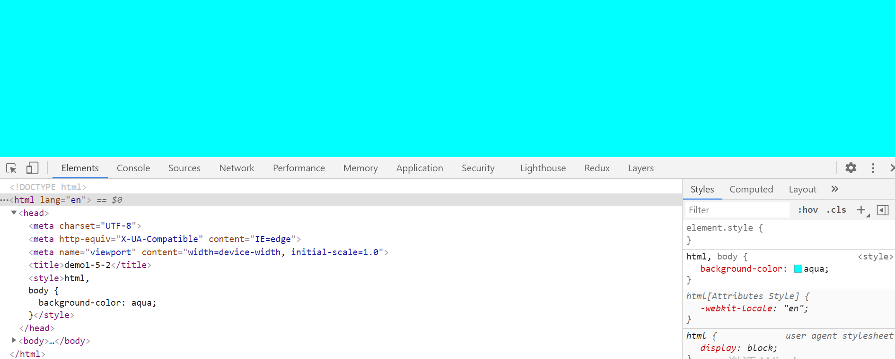
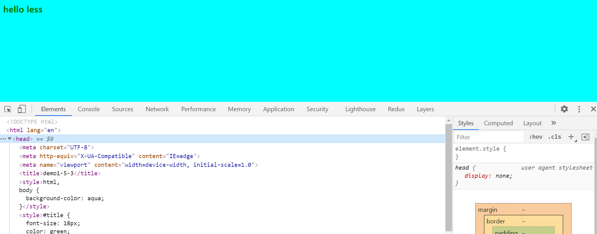

### 通过`npm script` 运行`webpack`

输入 `webpack ./src/index.js -o ./build --mode=development` 指令比较麻烦，可以在 `package.json` 的 `scripts` 中定义任务，通过 `npm run start` 运行构建，代码如下：

    "scripts": {
        "start": "webpack --config webpack.config.js"
    }

每次在当前项目局部安装 `webpack webpack-cli` 等依赖后，会在 `node_modules/.bin` 目录下创建软链接， `package.json` 默认可以读取 `node_modules/.bin` 目录下的命令，若在 `Npm Script` 中指定 `Webpack`，`node` 会直接去 `node_modules/.bin` 目录下寻找 `Webpack` 并运行。   

### `webpack.config.js` 配置文件

若 `Webpack` 执行命令没有配置 `--config` ，在执行 `Webpack` 构建时默认会从项目根目录下的 `webpack.config.js` 文件读取配置。

由于所有的构建工具都是基于 `nodejs` 平台运行的，所以该文件需要通过 `CommonJS` 规范暴露出一个对象，内容如下（示例  `demo1-5-1` ）：

    const path = require('path');

    module.exports = {
      // 入口起点
      entry: './src/index.js',
      // 输出
      output: {
        // 输出文件名，把所有依赖的模块合并输出到一个 bundle.js 文件
        filename: 'bundle.js',
        // 输出路径，绝对路径，输出文件都放到 build 目录下
        // __dirname是nodejs的变量，代表当前文件（即webpack.config.js）的目录（即demo1-5-1）的绝对路径
        path: path.resolve(__dirname, './build'),
      },
      // loader配置
      module: {
        rules: [
          // 详细的loader配置
        ]
      },
      // plugins配置
      plugins: [
        // 详细的plugins配置
      ],
      // 模式
      mode: 'development', // 开发模式
      // mode: 'production'
    };

### 打包样式资源

添加 `css-loader、style-loader`，`webpack.config.js` 配置文件如下：

    const path = require('path');

    module.exports = {
      // 入口起点
      entry: './src/index.js',
      // 输出
      output: {
        // 输出文件名，把所有依赖的模块合并输出到一个 bundle.js 文件
        filename: 'bundle.js',
        // 输出路径，绝对路径，输出文件都放到 build 目录下
        // __dirname是nodejs的变量，代表当前文件（即webpack.config.js）的目录（即demo1-5-1）的绝对路径
        path: path.resolve(__dirname, './build'),
      },
      // loader配置
      module: {
        rules: [
          // 详细的loader配置
          {
            // 匹配哪些文件
            test: /\.css$/,
            // 使用哪些loader处理
            use: [
              // loader执行顺序：从右到左，从下到上依次执行
              // 创建style标签，将js中的样式资源插入到style标签内，然后添加到html head中
              'style-loader',
              // 将css文件转换成样式字符串，变成commonjs模块，并整合到js文件中
              'css-loader'
            ]
          }
        ]
      },
      // plugins配置
      plugins: [
        // 详细的plugins配置
      ],
      mode: 'development',
      // mode: 'production'
    };

为了避免每个 `demo` 重复下载依赖包，利用 `node` 在本目录找不到依赖包就会去上级目录查找的特点，我么后续都将依赖包下载到  `webpack5` 根目录下。

进入 `webpack5` 根目录，初始化包描述文件

    npm init  

安装 `webpack webpack-cli`

    npm i webpack webpack-cli -D

    + webpack-cli@4.8.0
    + webpack@5.51.1

安装 `css-loader style-loader` 

    npm i css-loader style-loader -D

    + css-loader@6.2.0
    + style-loader@3.2.1

`cd demo1-5-2`， 运行 `webpack`，`index.css` 打包后的代码如下，里边包含 `background-color: aqua` 代码：

    "../../../node_modules/css-loader/dist/cjs.js!./src/index.css": ((module, __webpack_exports__, __webpack_require__) => {
      eval("...\n// Module\n___CSS_LOADER_EXPORT___.push([module.id, \"html,\\r\\nbody {\\r\\n  background-color: aqua;\\r\\n}\", \"\"]);\n// ..."); 
    }),

在 `build` 目录下新建 `index.html` 文件：

    <!DOCTYPE html>
    <html lang="en">
    <head>
      <meta charset="UTF-8">
      <meta http-equiv="X-UA-Compatible" content="IE=edge">
      <meta name="viewport" content="width=device-width, initial-scale=1.0">
      <title>demo1-5-2</title>
    </head>
    <body>
      
    </body>
    </html>

在浏览器打开 `index.html` ，样式生效，`index.css` 代码被插入到 `style` 标签中：

### 回顾打包流程
   - 首先，`Webpack` 通过 `entry` 将 `index.js` 文件加载进来
   - 分析 `index.js` 文件，发现引入了 `index.css` 文件，再将 `index.css` 文件加载进来
   - 通过 `loader` 处理每个资源，若命中 `*.css` 资源，将使用 `css-loader style-loader` 对 `index.css` 进行先后处理
   - 通过 `css-loader` 将 `css` 文件转换成样式字符串，变成 `commonjs` 模块，并整合到 `js` 文件中
   - 通过 `style-loader` 将样式资源插入到新创建的 `style` 标签内，然后添加到 `html head` 中
   - 最终将打包后的文件输出到 `output` 指定的文件目录下

### 引入 `less` (参考 `demo1-5-3` )

`LESS` 是一种 `CSS` 预处理器，它的语法和 `CSS` 相似，但加入了变量、逻辑、函数和模块化-按需加载等编程特性。可以使得 `CSS`编写更加简洁。 

`index.less`

    @primary: green;

    #title {
      font-size: 18px;
      color    : @primary;
    }

`index.js`

    import './index.css';
    import './index.less';

    function add (x, y) {
      return x + y;
    }

    console.log(add(1, 2));    

由于需要把 `LESS` 源代码转换成 `CSS` 代码，Webpack 官方提供了对应的 `less-loader`。

安装 `less less-loader`

    npm i less less-loader -D

    // 需要下载less，否则会报错
    + less@4.1.1 
    + less-loader@10.0.1

`webpack.config.js`

    module.exports = {
      // 入口起点
      entry: './src/index.js',
      // 输出
      output: {
        // 输出文件名，把所有依赖的模块合并输出到一个 bundle.js 文件
        filename: 'bundle.js',
        // 输出路径，绝对路径，输出文件都放到 build 目录下
        // __dirname是nodejs的变量，代表当前文件（即webpack.config.js）的目录（即demo1-5-1）的绝对路径
        path: path.resolve(__dirname, './build'),
      },
      // loader配置
      module: {
        rules: [
          // 详细的loader配置
          {
            // 匹配哪些文件
            test: /\.css$/,
            // 使用哪些loader处理
            use: [
              // loader执行顺序：从右到左，从下到上依次执行
              // 创建style标签，将js中的样式资源插入到style标签内，然后添加到html head中
              'style-loader',
              // 将css文件转换成样式字符串，变成commonjs模块，并整合到js文件中
              'css-loader'
            ]
          },
          {
            test: /\.less$/,
            use: [
              'style-loader',
              'css-loader',
              // 将 less 文件编译成 css 文件，需要下载less less-loader
              'less-loader'
            ]
          }
        ]
      },
      // plugins配置
      plugins: [
        // 详细的plugins配置
      ],
      mode: 'development',
      // mode: 'production'
    };

`cd demo1-5-3`， 运行 `webpack`，`index.less` 打包后的代码如下，里边包含 `color: green;` 代码：

    "../../../node_modules/css-loader/dist/cjs.js!../../../node_modules/less-loader/dist/cjs.js!./src/index.less":  ((module, __webpack_exports__, __webpack_require__) => {
      eval("...\n// Module\n___CSS_LOADER_EXPORT___.push([module.id, \"#title {\\n  font-size: 18px;\\n  color: green;\\n}\\n\", \"\"]);\n//...);
    }),

    
在 `build` 目录下新建 `index.html` 文件：

    <!DOCTYPE html>
    <html lang="en">
    <head>
      <meta charset="UTF-8">
      <meta http-equiv="X-UA-Compatible" content="IE=edge">
      <meta name="viewport" content="width=device-width, initial-scale=1.0">
      <title>demo1-5-3</title>
    </head>
    <body>
      <h1 id="title">hello less</h1>
      
    </body>
    </html>

在浏览器打开 `index.html` ，样式生效，`index.less` 代码被插入到 `style` 标签中。

### `loader` 的用法总结

  - 通过 `test` 去检测文件类型
  - 通过 `use` 决定使用哪些 `loader` 对文件进行转换
  - 不同的文件类型需要配置相应的 `loader` 